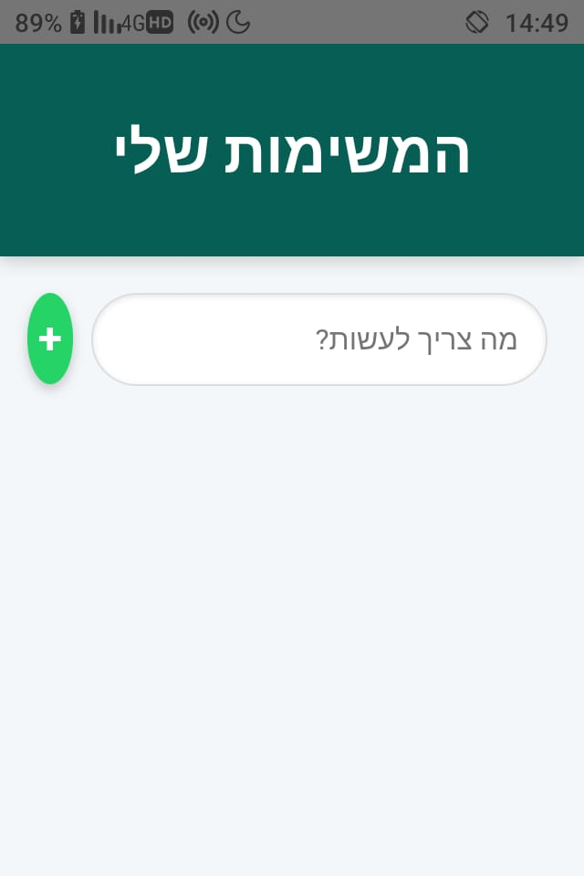

# Quick Tasks App 📱

A lightweight, fast, and intuitive Task Management mobile application. This project demonstrates how to wrap a modern Web Application into a native Android APK using **Capacitor**.

<p align="center">
  
</p>

## 🚀 Features
* **Real-time Task Management**: Add and remove tasks instantly.
* **Persistent Storage**: Uses `LocalStorage` to ensure your tasks are saved even after closing the app.
* **Mobile-First Design**: Fully responsive UI designed for a native mobile feel.
* **Cross-Platform Ready**: Built with web technologies (HTML5, CSS3, JavaScript).

## 🛠️ Tech Stack
* **Frontend**: Vanilla HTML, CSS, JavaScript.
* **Bridge**: [Capacitor](https://capacitorjs.com/) (by Ionic).
* **Platform**: Android (Native WebView).

## 📥 Installation
You can download the ready-to-install APK from the **[Releases](https://github.com/devapp-sys/quick-tasks-app/releases)** section. 
> **Note:** Since this is a debug APK, you may need to allow "Install from Unknown Sources" on your Android device.

## 🏗️ Development Setup
If you want to run this project locally and build it yourself:

1. **Clone the repository:**
   ```bash
   git clone [https://github.com/devapp-sys/quick-tasks-app.git](https://github.com/devapp-sys/quick-tasks-app.git)
   cd quick-tasks-app
Install dependencies:

Bash

npm install
Sync with Android project:

Bash

npx cap sync
Open in Android Studio:

Bash

npx cap open android
📝 License
This project is open-source and available under the MIT License.
